<div align="center">

# ⚡ AnalyzerCore

### _Real-time DeFi Intelligence Platform_

[](https://dotnet.microsoft.com/)
[](https://github.com/AIgen-Solutions-s-r-l/Analyzer/actions)
[](LICENSE)
[](https://hub.docker.com/)

[](k8s/)
[](https://opentelemetry.io/)
[](https://redis.io/)
[](https://dotnet.microsoft.com/apps/aspnet/signalr)

<br/>

**Enterprise-grade blockchain analytics engine for DeFi price discovery, arbitrage detection, and liquidity intelligence.**

[Getting Started](#-quick-start) •
[Features](#-features) •
[Architecture](#-architecture) •
[API Docs](#-api-documentation) •
[Deploy](#-deployment)

<br/>


&nbsp;&nbsp;

&nbsp;&nbsp;

&nbsp;&nbsp;

&nbsp;&nbsp;

&nbsp;&nbsp;


</div>

---

## 🎯 What is AnalyzerCore?

AnalyzerCore is a **high-performance DeFi analytics engine** that monitors blockchain activity in real-time, providing institutional-grade insights for:

- 💰 **Price Discovery** — Real-time token prices from DEX pools with TWAP calculations
- 🔄 **Arbitrage Detection** — Cross-DEX and triangular arbitrage opportunity scanning
- 📊 **Liquidity Analytics** — TVL tracking, impermanent loss calculations, concentration analysis
- ⚡ **Real-time Streaming** — WebSocket feeds for prices, trades, and alerts

Built for **traders**, **DeFi protocols**, and **quant teams** who need reliable, low-latency market data.

---

## ✨ Features

<table>
<tr>
<td width="50%">

### 🔮 Price Oracle
- Spot prices from highest-liquidity pools
- USD conversion via stablecoin routing
- TWAP for manipulation resistance
- Historical price charts

</td>
<td width="50%">

### ⚡ Arbitrage Scanner
- Real-time cross-DEX scanning
- Triangular arbitrage paths (A→B→C→A)
- Gas-adjusted profit calculations
- Confidence scoring system

</td>
</tr>
<tr>
<td width="50%">

### 📈 Liquidity Intelligence
- Pool TVL & volume metrics
- APR calculations from fees
- Impermanent loss calculator
- HHI concentration index

</td>
<td width="50%">

### 🌐 Real-time WebSocket
- SignalR streaming hub
- Subscribe to tokens/pools
- Arbitrage alerts
- New token/pool discovery

</td>
</tr>
</table>

---

## 🏗 Architecture


### Clean Architecture Layers

```mermaid
graph LR
    subgraph "🎯 Domain"
        E[Entities]
        VO[Value Objects]
        DE[Domain Events]
        SI[Service Interfaces]
    end

    subgraph "📱 Application"
        CMD[Commands]
        QRY[Queries]
        HND[Handlers]
        BHV[Behaviors]
    end

    subgraph "🔧 Infrastructure"
        EF[EF Core]
        BC[Blockchain]
        CH[Caching]
        RT[Real-time]
    end

    subgraph "🌐 API"
        CTR[Controllers]
        MW[Middleware]
        HUB[SignalR Hubs]
    end

    API --> Application
    Application --> Domain
    Infrastructure --> Domain
    Infrastructure --> Application
```



---

## 🛠 Tech Stack

| Category | Technologies |
|----------|-------------|
| **Runtime** | .NET 6.0, C# 10, ASP.NET Core |
| **Architecture** | Clean Architecture, DDD, CQRS, Event Sourcing |
| **Database** | SQLite (dev), PostgreSQL (prod), EF Core 6 |
| **Caching** | Redis, In-Memory L1/L2 Hybrid |
| **Messaging** | MediatR, Domain Events, Outbox Pattern |
| **Real-time** | SignalR WebSocket, Rate Limiting |
| **Blockchain** | Nethereum, Polly Resilience |
| **Auth** | JWT Bearer, API Keys, BCrypt |
| **Observability** | OpenTelemetry, Prometheus, Grafana, Jaeger, Seq |
| **Testing** | xUnit, FluentAssertions, Moq, ArchUnitNET |
| **DevOps** | Docker, Kubernetes, Helm, GitHub Actions |

---

## 🚀 Quick Start

### Prerequisites

- [.NET 6.0 SDK](https://dotnet.microsoft.com/download/dotnet/6.0)
- [Docker](https://www.docker.com/get-started) (recommended)
- Ethereum RPC endpoint (Infura, Alchemy, or local node)

### Option 1: Docker Compose (Recommended)

```bash
# Clone the repository
git clone https://github.com/AIgen-Solutions-s-r-l/Analyzer.git
cd Analyzer

# Configure environment
cp .env.example .env
# Edit .env with your RPC_URL and JWT_SECRET

# Launch full stack
docker-compose up -d

# 🎉 Access services:
# API:        http://localhost:8080
# Swagger:    http://localhost:8080/swagger
# Grafana:    http://localhost:3000 (admin/admin)
# Jaeger:     http://localhost:16686
# Seq:        http://localhost:5341
# Prometheus: http://localhost:9090
```

### Option 2: Local Development

```bash
# Restore & build
dotnet restore
dotnet build

# Run migrations
dotnet ef database update --project src/AnalyzerCore.Infrastructure

# Start API
dotnet run --project src/AnalyzerCore.Api

# Run tests
dotnet test
```

---

## 📡 API Documentation

### Authentication

```bash
# API Key (header)
curl -H "X-API-Key: your-key" http://localhost:8080/api/v1/prices/0x...

# JWT Bearer
curl -H "Authorization: Bearer your-token" http://localhost:8080/api/v1/prices/0x...
```

### Core Endpoints

```http
# 💰 Prices
GET /api/v1/prices/{tokenAddress}              # Spot price
GET /api/v1/prices/{tokenAddress}/usd          # USD price
GET /api/v1/prices/{tokenAddress}/twap         # Time-weighted average
GET /api/v1/prices/{tokenAddress}/history      # Historical data

# ⚡ Arbitrage
GET /api/v1/arbitrage/scan                     # Scan all opportunities
GET /api/v1/arbitrage/token/{address}          # Token-specific
GET /api/v1/arbitrage/triangular               # Triangular paths
GET /api/v1/arbitrage/calculate                # Optimal amount

# 📊 Liquidity
GET /api/v1/liquidity/pools/{address}          # Pool metrics
GET /api/v1/liquidity/tokens/{address}         # Token liquidity
GET /api/v1/liquidity/top-pools                # Top TVL pools
POST /api/v1/liquidity/impermanent-loss        # IL calculator
GET /api/v1/liquidity/concentration/{address}  # HHI analysis
```

### WebSocket Subscriptions

```javascript
import * as signalR from "@microsoft/signalr";

const connection = new signalR.HubConnectionBuilder()
    .withUrl("http://localhost:8080/hubs/blockchain", {
        accessTokenFactory: () => "your-api-key"
    })
    .withAutomaticReconnect()
    .build();

// Subscribe to events
connection.on("ReceivePriceUpdate", (data) => {
    console.log(`${data.tokenSymbol}: $${data.priceUsd}`);
});

connection.on("ReceiveArbitrageAlert", (arb) => {
    console.log(`🚨 ${arb.tokenSymbol}: $${arb.netProfitUsd} profit!`);
});

await connection.start();
await connection.invoke("SubscribeToToken", "0xc02aaa39...");
await connection.invoke("SubscribeToArbitrage", 50); // min $50 profit
```

### Postman Collection

Import our ready-to-use collection: [`docs/postman/AnalyzerCore-API.postman_collection.json`](docs/postman/AnalyzerCore-API.postman_collection.json)

---

## 📊 Monitoring & Observability


### Dashboards

| Service | URL | Credentials |
|---------|-----|-------------|
| **Grafana** | http://localhost:3000 | admin / admin |
| **Jaeger** | http://localhost:16686 | — |
| **Seq** | http://localhost:5341 | — |
| **Prometheus** | http://localhost:9090 | — |

### Key Metrics

- `analyzercore_arbitrage_opportunities_total` — Opportunities detected
- `analyzercore_price_requests_total` — Price API calls
- `analyzercore_blocks_processed_total` — Blocks scanned
- `analyzercore_websocket_connections` — Active WebSocket clients

---

## 🚢 Deployment

### Kubernetes

```bash
# Using Helm
helm install analyzercore ./helm \
  --set image.tag=latest \
  --set config.rpcUrl=$RPC_URL \
  --set secrets.jwtSecret=$JWT_SECRET

# Or raw manifests
kubectl apply -f k8s/
```

### Production Checklist

- [ ] Configure production RPC endpoint
- [ ] Set strong JWT secret (32+ chars)
- [ ] Enable Redis for distributed caching
- [ ] Configure PostgreSQL instead of SQLite
- [ ] Set up SSL/TLS termination
- [ ] Configure rate limiting per tier
- [ ] Enable Prometheus scraping
- [ ] Set up alerting rules

---

## 🧪 Testing

```bash
# Run all tests
dotnet test

# With coverage
dotnet test --collect:"XPlat Code Coverage"

# Architecture tests only
dotnet test --filter "FullyQualifiedName~Architecture"

# Integration tests
dotnet test --filter "FullyQualifiedName~Integration"
```

### Test Projects

| Project | Description |
|---------|-------------|
| `AnalyzerCore.Domain.Tests` | Entity & value object tests |
| `AnalyzerCore.Application.Tests` | Handler & behavior tests |
| `AnalyzerCore.Infrastructure.Tests` | Repository & service tests |
| `AnalyzerCore.Api.Tests` | Controller unit tests |
| `AnalyzerCore.Api.IntegrationTests` | Full API integration tests |
| `AnalyzerCore.Architecture.Tests` | Clean architecture validation |

---

## 📁 Project Structure

```
AnalyzerCore/
├── 📂 src/
│   ├── 📂 AnalyzerCore.Domain/          # Entities, Value Objects, Interfaces
│   ├── 📂 AnalyzerCore.Application/     # Commands, Queries, Handlers
│   ├── 📂 AnalyzerCore.Infrastructure/  # EF Core, Blockchain, Caching
│   └── 📂 AnalyzerCore.Api/             # Controllers, Hubs, Middleware
├── 📂 tests/
│   ├── 📂 AnalyzerCore.Domain.Tests/
│   ├── 📂 AnalyzerCore.Application.Tests/
│   ├── 📂 AnalyzerCore.Infrastructure.Tests/
│   ├── 📂 AnalyzerCore.Api.Tests/
│   ├── 📂 AnalyzerCore.Api.IntegrationTests/
│   └── 📂 AnalyzerCore.Architecture.Tests/
├── 📂 docs/                             # Documentation
├── 📂 k8s/                              # Kubernetes manifests
├── 📂 helm/                             # Helm charts
├── 📂 monitoring/                       # Grafana dashboards
├── 📄 Dockerfile
├── 📄 docker-compose.yml
└── 📄 appsettings.json
```

---

## 🤝 Contributing

We love contributions! Please see our [Contributing Guide](CONTRIBUTING.md) for details.

```bash
# Fork & clone
git clone https://github.com/YOUR_USERNAME/Analyzer.git

# Create feature branch
git checkout -b feature/amazing-feature

# Make changes & test
dotnet test

# Commit with conventional commits
git commit -m "feat: add amazing feature"

# Push & create PR
git push origin feature/amazing-feature
```

---

## 📜 License

This project is licensed under the **MIT License** — see the [LICENSE](LICENSE) file for details.

---

<div align="center">

### Built with ❤️ by the AnalyzerCore Team

**[⬆ Back to Top](#-analyzercore)**

<br/>

[](https://github.com/AIgen-Solutions-s-r-l/Analyzer/stargazers)
[](https://github.com/AIgen-Solutions-s-r-l/Analyzer/network/members)
[](https://github.com/AIgen-Solutions-s-r-l/Analyzer/watchers)

</div>
